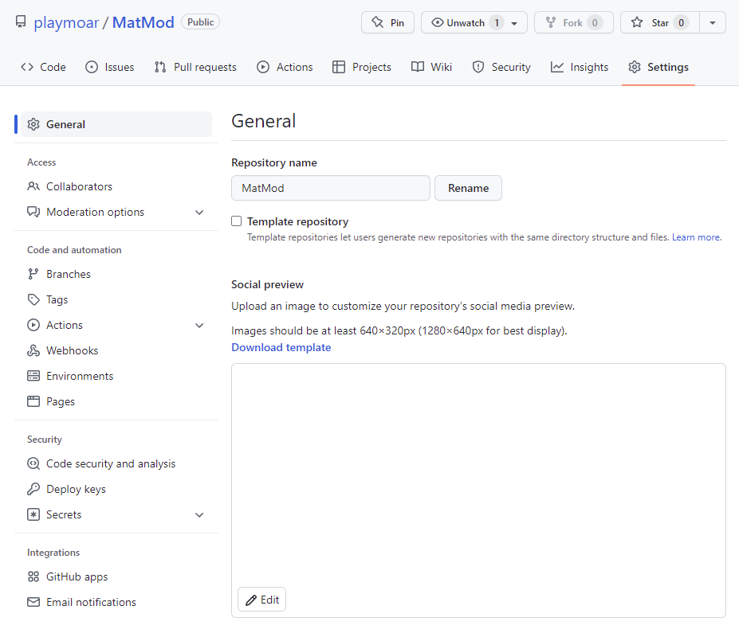
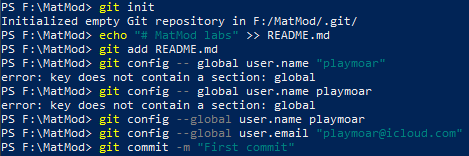
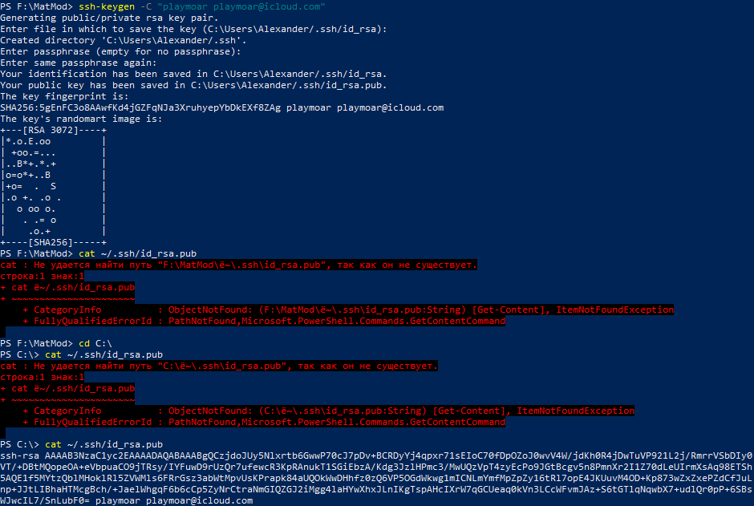
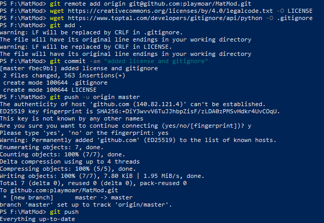
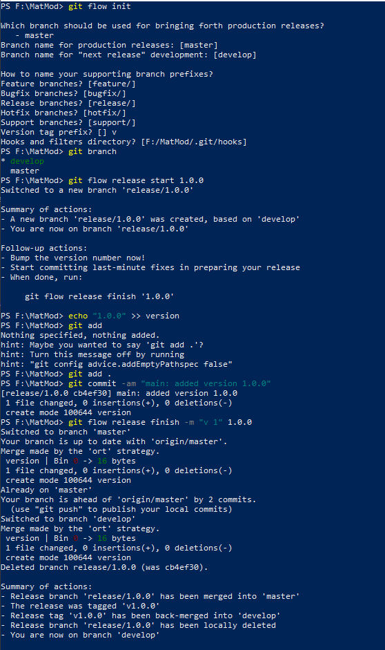
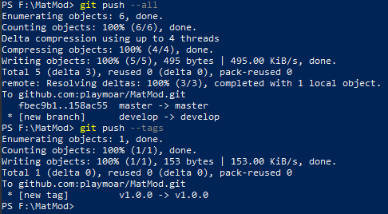

---
## Front matter
lang: ru-RU
title: Знакомство с системой контроля версий git
author: |
	Казаков Александр НПИбд-02-19\inst{1}

institute: |
	\inst{1}Российский Университет Дружбы Народов

date: 23 мая, 2022, Москва, Россия

## Formatting
mainfont: PT Serif
romanfont: PT Serif
sansfont: PT Sans
monofont: PT Mono
toc: false
slide_level: 2
theme: metropolis
header-includes: 
 - \metroset{progressbar=frametitle,sectionpage=progressbar,numbering=fraction}
 - '\makeatletter'
 - '\beamer@ignorenonframefalse'
 - '\makeatother'
aspectratio: 43
section-titles: true

---

# Цели и задачи работы

## Цель лабораторной работы

Изучить работу с системой контроля версий git.

## Задачи лабораторной работы

1. Создать учетную запись на github.com

2. Создать и настроить репозиторий

3. Изучить механизм управления версиями, ветками.

# Процесс выполнения лабораторной работы

## Создание учетной записи и репозитория на github.com 

{ #fig:001 width=70% height=70% }

## Инициализация локального репозитория

Создан файл README.md, установлены имя пользователя и e-mail, сделан первый commit.

{ #fig:002 width=70% height=70% }

## Создание SSH-ключа
Создан SSH-ключ. Созданный ключ добавлен в настройках пользователя github.com.

{ #fig:003 width=70% height=70% }

## Отправка файлов в репозиторий
Загружены файлы лицензионного соглашения и gitignore. Получен доступ к сетевому репозиторию, загруженные файлы отправлены в репозиторий.

{ #fig:004 width=70% height=70% }

## Управление ветками и версиями 
Создана тестовая ветка, начат и завершён тестовый релиз.

{ #fig:005 width=70% height=70% }

## Отправка внесённых изменений в репозиторий

{ #fig:006 width=70% height=70% }

# Итоги

## Вывод

Изучена работа с системой контроля версий git, приобретены навыки создания и управления репозиторием, ветками и релизами.