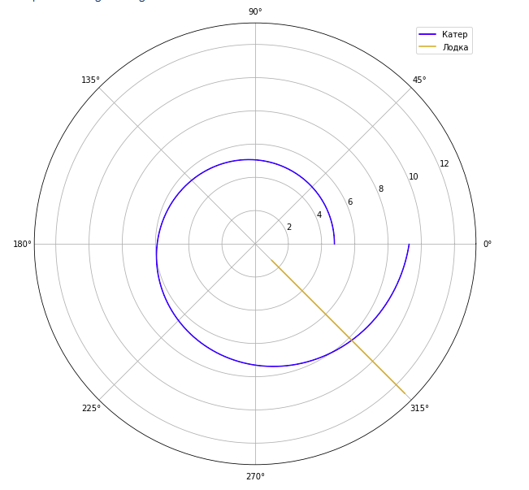

---
## Front matter
lang: ru-RU
title: Задача о погоне
author: |
	Казаков Александр НПИбд-02-19\inst{1}

institute: |
	\inst{1}Российский Университет Дружбы Народов

date: 23 мая, 2022, Москва, Россия

## Formatting
mainfont: PT Serif
romanfont: PT Serif
sansfont: PT Sans
monofont: PT Mono
toc: false
slide_level: 2
theme: metropolis
header-includes: 
 - \metroset{progressbar=frametitle,sectionpage=progressbar,numbering=fraction}
 - '\makeatletter'
 - '\beamer@ignorenonframefalse'
 - '\makeatother'
aspectratio: 43
section-titles: true

---

# Цели и задачи работы

## Цель лабораторной работы

Изучение примера построения математических моделей для выбора правильной стратегии при решении задач поиска. 

## Задание к лабораторной работе

1. Провести необходимые рассуждения и вывод дифференциальных уравнений, если скорость катера больше скорости лодки в n раз.
2. Построить траекторию движения катера и лодки для двух случаев. 
3. Определить по графику точку пересечения катера и лодки.

# Процесс выполнения лабораторной работы

## Условие задачи

На море в тумане катер береговой охраны преследует лодку браконьеров.
Через определенный промежуток времени туман рассеивается, и лодка обнаруживается на расстоянии 16.7 км от катера. 
Затем лодка снова скрывается в тумане и уходит прямолинейно в неизвестном направлении. 
Известно, что скорость катера в 4.5 раза больше скорости браконьерской лодки

## Теоретический материал 

$t_0=0, X_0=0$  - местонахождение лодки браконьеров в момент обнаружения  
$X_0=16,7$   - место нахождения катера береговой охраны относительно лодки браконьеров в момент обнаружения лодки.  

Вводим полярные координаты. Будем считать, что полюс - это точка обнаружения браконьеров $x_0=\theta=0$  
Полярная ось r будет проходить через точку местонахождения лодки береговой охраны.  

## Теоретический материал 

За время $t$ лодка пройдет $x$, а катер $x-k$ (или $x+k$, в зависимости от случая).  
Так как время, которое они двигались, одинаково, можем составить следующее уравнение:  
$\frac{x}{v} = \frac{x+k}{v}$ для первого случая,     
$\frac{x}{v} =  \frac{x-k}{v}$ для второго случая.  

Отсюда находим $x_1$ и $x_2$  

$x_1=\frac{167}{55}$ ,при $\theta=0$  

$x_2=\frac{167}{35}$ ,при $\theta=-\pi$  

## Теоретический материал 

Далее рассмотрим скорость катера. Она складывается из скорости радиальной и тангенциальной. Таким образом  
$v_r=r\frac{d\theta}{dt}=v$

$v_t=r\frac{d\theta}{dt}$.  
По теореме Пифагора тангенциальная скорость также равна $v_t= \sqrt{20,25v_r^2-v^2}$.   
Поскольку, радиальная скорость равна $v$,  $v_t= \sqrt{20,25v^2-v^2 }$.  
Следовательно, $v_t=v\frac{\sqrt{77}}{2}$.  

Получим $r\frac{d\theta}{dt}=v\frac{\sqrt{77}}{2}$

## Теоретический материал 

Решение исходной задачи сводится к решению системы из двух дифференциальных уравнений 

$$
 \begin{cases}
   \frac{dr}{dt}=v
	\\   
	r\frac{d\theta}{dt}=v\frac{\sqrt{77}}{2}
 \end{cases}
$$  

с начальными условиями

$$
 \begin{cases}
   \theta_0=0
   \\
	r_0=\frac{167}{55}
 \end{cases}
\
$$

$$
 \begin{cases}
   \theta_0=-\pi
   \\
	r_0=\frac{167}{35}
 \end{cases}
\
$$

## Теоретический материал 

Из полученной системы возможно исключить производную по t  
Получим следующее уравнение: $\frac{dr}{d\theta}=\frac{2r}{\sqrt{77}}$

## Полученные в результате моделирования траектории. Первый случай

{ #fig:001 width=70% height=70% }

## Полученные в результате моделирования траектории. Второй случай

{ #fig:002 width=70% height=70% }

# Итоги

## Вывод

Рассмотрена задача о погоне. Выведены соответствующие дифференциальные уравнения. Построена математическая модель для выбора правильной стратегии.
