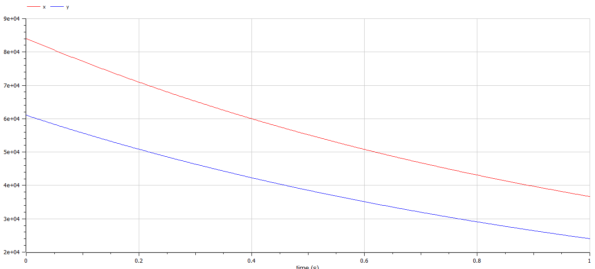
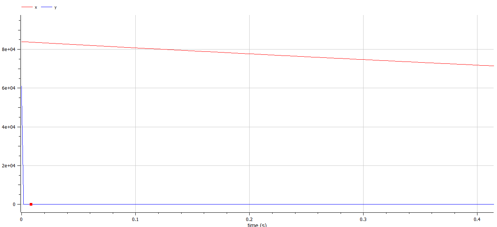

---
## Front matter
lang: ru-RU
title: Модель боевых действий
author: |
	Казаков Александр НПИбд-02-19\inst{1}

institute: |
	\inst{1}Российский Университет Дружбы Народов

date: 23 мая, 2022, Москва, Россия

## Formatting
mainfont: PT Serif
romanfont: PT Serif
sansfont: PT Sans
monofont: PT Mono
toc: false
slide_level: 2
theme: metropolis
header-includes: 
 - \metroset{progressbar=frametitle,sectionpage=progressbar,numbering=fraction}
 - '\makeatletter'
 - '\beamer@ignorenonframefalse'
 - '\makeatother'
aspectratio: 43
section-titles: true

---

# Цели и задачи работы

## Цель лабораторной работы

Рассмотреть некоторые простейшие модели боевых действий – модели Ланчестера. 

## Задание к лабораторной работе

1. Изучить некоторые простейшие модели боевых действий – модели Ланчестера.
2. Построить графики изменения численности войск.
3. Определить победившую сторону.

# Процесс выполнения лабораторной работы

## Задача

Между страной $X$ и страной $Y$ идет война. Численность состава войск исчисляется от начала войны, и являются временными функциями $x(t)$ и $y(t)$
В начальный момент времени страна $X$ имеет армию численностью 84000 человек, а в распоряжении страны $Y$ армия численностью в 61000 человек.
Для упрощения модели считаем, что коэффициенты $a, b, c, h$ постоянны. 
Также считаем $P(t), Q(t)$ непрерывные функции.
Постройте графики изменения численности войск армии $X$ и армии $Y$ для следующих случаев:

## Первый случай. Модель боевых действий между регулярными войсками

$$
 \begin{cases}
	\frac{dx}{dt}= -0.37x(t) - 0.66y(t) + sin(5t+1)+1
	\\   
	\frac{dy}{dt}= -0.37x(t) - 0.4y(t) + cos(3t+2)+1
 \end{cases}
$$

{ #fig:003 width=60% height=60% }

## Второй случай. Модель ведения боевых действий с участием регулярных войск и партизанских отрядов

$$
 \begin{cases}
	\frac{dx}{dt}= -0.39x(t) - 0.91y(t) + |sin(2t)|
	\\   
	\frac{dy}{dt}= -0.54x(t)y(t) - 0.29y(t) + |cos(6t)|
 \end{cases}
$$

{ #fig:004 width=60% height=60% }

# Итоги

## Вывод

Рассмотрены некоторые простейшие модели боевых действий – модели Ланчестера, построены графики изменения численности войск, определена победившая сторона. 