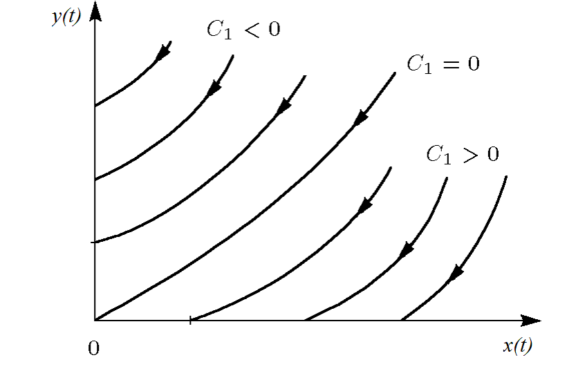
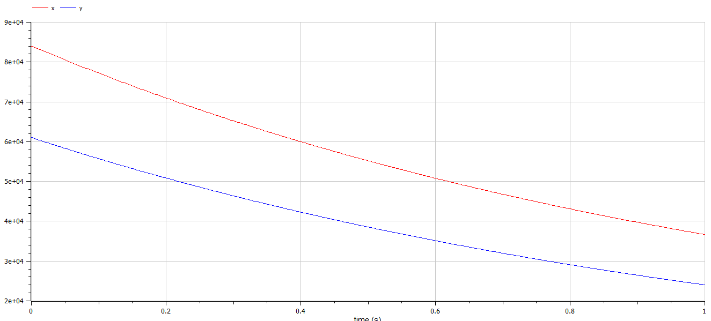
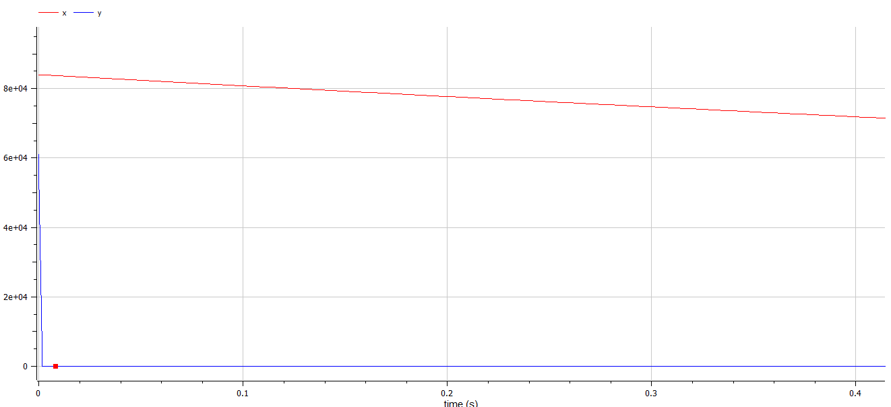

---
# Front matter
lang: ru-RU
title: "Отчет по лабораторной работе №3"
subtitle: "Модель боевых действий - вариант 48"
author: "Казаков Александр НПИбд-02-19"

# Formatting
toc-title: "Содержание"
toc: true # Table of contents
toc_depth: 2
lof: true # List of figures
fontsize: 12pt
linestretch: 1.5
papersize: a4paper
documentclass: scrreprt
polyglossia-lang: russian
polyglossia-otherlangs: english
mainfont: PT Serif
romanfont: PT Serif
sansfont: PT Sans
monofont: PT Mono
mainfontoptions: Ligatures=TeX
romanfontoptions: Ligatures=TeX
sansfontoptions: Ligatures=TeX,Scale=MatchLowercase
monofontoptions: Scale=MatchLowercase
indent: true
pdf-engine: lualatex
header-includes:
  - \linepenalty=10 # the penalty added to the badness of each line within a paragraph (no associated penalty node) Increasing the υalue makes tex try to haυe fewer lines in the paragraph.
  - \interlinepenalty=0 # υalue of the penalty (node) added after each line of a paragraph.
  - \hyphenpenalty=50 # the penalty for line breaking at an automatically inserted hyphen
  - \exhyphenpenalty=50 # the penalty for line breaking at an explicit hyphen
  - \binoppenalty=700 # the penalty for breaking a line at a binary operator
  - \relpenalty=500 # the penalty for breaking a line at a relation
  - \clubpenalty=150 # extra penalty for breaking after first line of a paragraph
  - \widowpenalty=150 # extra penalty for breaking before last line of a paragraph
  - \displaywidowpenalty=50 # extra penalty for breaking before last line before a display math
  - \brokenpenalty=100 # extra penalty for page breaking after a hyphenated line
  - \predisplaypenalty=10000 # penalty for breaking before a display
  - \postdisplaypenalty=0 # penalty for breaking after a display
  - \floatingpenalty = 20000 # penalty for splitting an insertion (can only be split footnote in standard LaTeX)
  - \raggedbottom # or \flushbottom
  - \usepackage{float} # keep figures where there are in the text
  - \floatplacement{figure}{H} # keep figures where there are in the text
---

# Цель работы

Рассмотреть некоторые простейшие модели боевых действий – модели Ланчестера. 


# Задание

1. Изучить некоторые простейшие модели боевых действий – модели Ланчестера
2. Построить графики изменения численности войск
3. Определить победившую сторону

# Выполнение лабораторной работы

## Теоретические сведения

Рассмотрим три случая ведения боевых действий: 
1. Боевые действия между регулярными войсками 
2. Боевые действия с участием регулярных войск и партизанских отрядов 
3. Боевые действия между партизанскими отрядами 

В первом случае численность регулярных войск определяется тремя факторами:

* скорость уменьшения численности войск из-за причин, не связанных с боевыми действиями (болезни, травмы, дезертирство);
* скорость потерь, обусловленных боевыми действиями противоборствующих сторон (что связанно с качеством стратегии, уровнем вооружения, профессионализмом солдат и т.п.);
* скорость поступления подкрепления (задаётся некоторой функцией от времени). 

В этом случае модель боевых действий между регулярными войсками описывается следующим образом

$$
 \begin{cases}
	\frac{dx}{dt}= -a(t)x(t) - b(t)y(t) + P(t)
	\\   
	\frac{dy}{dt}= -c(t)x(t) - h(t)y(t) + Q(t)
 \end{cases}
$$

Потери, не связанные с боевыми действиями, описывают члены $–a(t)x(t)$ и $–h(t)y(t)$, члены $–b(t)y(t)$ и $–c(t)x(t)$ отражают потери на поле боя. Коэффициенты $b(t)$, $c(t)$ указывают на эффективность боевых действий со стороны $y$ и $x$ соответственно, $a(t)$,$h(t)$  - величины, характеризующие степень влияния различных факторов на потери. Функции $P(t)$,$Q(t)$  учитывают возможность подхода подкрепления к войскам $X$ и $Y$ в течение одного дня. 

Во втором случае в борьбу добавляются партизанские отряды. Нерегулярные войска в отличии от постоянной армии менее уязвимы, так как действуют скрытно, в этом случае сопернику приходится действовать неизбирательно, по площадям, занимаемым партизанами. Поэтому считается, что темп потерь партизан, проводящих свои операции в разных местах на некоторой известной территории, пропорционален не только численности армейских соединений, но и численности самих партизан. В результате модель принимает вид:

$$
 \begin{cases}
	\frac{dx}{dt}= -a(t)x(t) - b(t)y(t) + P(t)
	\\   
	\frac{dy}{dt}= -c(t)x(t)y(t) - h(t)y(t) + Q(t)
 \end{cases}
$$

Модель ведение боевых действий между партизанскими отрядами с учетом предположений, сделанном в предыдущем случаем, имеет вид:

$$
 \begin{cases}
	\frac{dx}{dt}= -a(t)x(t) - b(t)x(t)y(t) + P(t)
	\\   
	\frac{dy}{dt}= -h(t)y(t) - c(t)x(t)y(t) + Q(t)
 \end{cases}
$$

В простейшей модели борьбы двух противников коэффициенты $b(t)$ и $c(t)$ являются постоянными. Попросту говоря, предполагается, что каждый солдат армии $x$ убивает за единицу времени $c$ солдат армии $y$ (и, соответственно, каждый солдат армии $y$ убивает $b$ солдат армии $x$). Также не учитываются потери, не связанные с боевыми действиями, и возможность подхода подкрепления. Состояние системы описывается точкой $(x,y)$ положительного квадранта плоскости. Координаты этой точки, $x$ и $y$ - это численности противостоящих армий. Тогда модель принимает вид

$$
 \begin{cases}
	\frac{dx}{dt}= -by
	\\   
	\frac{dy}{dt}= -ax
 \end{cases}
$$

Это - жесткая модель, которая допускает точное решение

$\frac{dx}{dy}=\frac{by}{cx}$

$cxdx=bydy, cx^2 - by^2 = C$

Эволюция численностей армий x и y происходит вдоль гиперболы, заданной этим уравнением (рис. -@fig:001). По какой именно гиперболе пойдет война, зависит от начальной точки.

{ #fig:001 width=70% height=70% }

Эти гиперболы разделены прямой  $\sqrt{cx}=\sqrt{by}$. Если начальная точка лежит выше этой прямой, то гипербола выходит на ось $y$. Это значит, что в ходе войны численность армии $x$ уменьшается до нуля (за конечное время). Армия $y$ выигрывает, противник уничтожен. 
Если начальная точка лежит ниже, то выигрывает армия $x$. В разделяющем эти случаи состоянии (на прямой) война заканчивается истреблением обеих армий. Но на это требуется бесконечно большое время: конфликт продолжает тлеть, когда оба противника уже обессилены. 
Вывод модели таков: для борьбы с вдвое более многочисленным противником нужно в четыре раза более мощное оружие, с втрое более многочисленным - в девять раз и т. д. (на это указывают квадратные корни в уравнении прямой). 
Стоит помнить, что эта модель сильно идеализирована и неприменима к реальной ситуации. Но может использоваться для начального анализа. 
Если рассматривать второй случай (война между регулярными войсками и партизанскими отрядами) с теми же упрощениями, то модель принимает вид:

$$
 \begin{cases}
	\frac{dx}{dt}= -by(t)
	\\   
	\frac{dy}{dt}= -cx(t)y(t)
 \end{cases}
$$

Эта система приводится к уравнению $\frac{d}{dt}= (\frac{b}{2}x^2(t)-cy(t))=0$
которое при заданных начальных условиях имеет единственное решение:
$\frac{b}{2}x^2(t)-cy(t)=\frac{b}{2}x^2(0)-cy(0)=C_1$

{ #fig:002 width=70% height=70% }

Из Рисунка @fig:002 видно, что при $C_1>0$ побеждает регулярная армия, при $C_1<0$ побеждают партизаны. Аналогично противоборству регулярных войск, победа обеспечивается не только начальной численностью, но и боевой выручкой и качеством вооружения. При $C_1>0$  получаем соотношение  $\frac{b}{2}x^2(0)>cy(0)$ Чтобы одержать победу партизанам необходимо увеличить коэффициент $c$ и повысить свою начальную численность на соответствующую величину. Причем это увеличение, с ростом начальной численности регулярных войск $x(0)$ должно расти не линейно, а пропорционально второй степени $x(0)$ . Таким образом, можно сделать вывод, что регулярные войска находятся в более выгодном положении, так как неравенство для них выполняется прим меньшем росте начальной численности войск.
Рассмотренные простейшие модели соперничества соответствуют системам обыкновенных дифференциальных уравнений второго порядка, широко распространенным при описании многих естественно научных объектов.


## Задача

Между страной $X$ и страной $Y$ идет война. Численность состава войск исчисляется от начала войны, и являются временными функциями $x(t)$ и $y(t)$
В начальный момент времени страна $X$ имеет армию численностью 84000 человек, а в распоряжении страны $Y$ армия численностью в 61000 человек.
Для упрощения модели считаем, что коэффициенты $a, b, c, h$ постоянны. 
Также считаем $P(t), Q(t)$ непрерывные функции.
Постройте графики изменения численности войск армии $X$ и армии $Y$ для следующих случаев:

1. Модель ведения боевых действий между регулярными войсками

$$
 \begin{cases}
	\frac{dx}{dt}= -0.37x(t) - 0.66y(t) + sin(5t+1)+1
	\\   
	\frac{dy}{dt}= -0.37x(t) - 0.4y(t) + cos(3t+2)+1
 \end{cases}
$$

{ #fig:003 width=70% height=70% }

Побеждает армия $X$.

2. Модель ведения боевых действий с участием регулярных войск и партизанских отрядов

$$
 \begin{cases}
	\frac{dx}{dt}= -0.39x(t) - 0.91y(t) + |sin(2t)|
	\\   
	\frac{dy}{dt}= -0.54x(t)y(t) - 0.29y(t) + |cos(6t)|
 \end{cases}
$$

{ #fig:004 width=70% height=70% }

Побеждает армия  $X$.

## Код программы

```
model lab3

parameter Real a = 0.37;
parameter Real b = 0.66;
parameter Real c = 0.37;
parameter Real h = 0.4;

parameter Real x0 = 84000;
parameter Real y0 = 61000;

Real x(start = x0);
Real y(start = y0);

equation
der(x) = -a * x - b * y + sin(5 * time + 1) + 1;
der(y) = -c * x - h * y + 2 * cos(3 * time + 2) + 1;

end lab3;

model lab3_2

parameter Real a = 0.39;
parameter Real b = 0.91;
parameter Real c = 0.54;
parameter Real h = 0.29;

parameter Real x0 = 84000;
parameter Real y0 = 61000;

Real x(start = x0);
Real y(start = y0);

equation
der(x) = -a * x - b * y + abs(sin(2 * time));
der(y) = -c * x * y - h * y + 2 * abs(cos(6 * time));

end lab3_2;
```

# Выводы

Рассмотрены некоторые простейшие модели боевых действий – модели Ланчестера, построены графики изменения численности войск, определена победившая сторона. 

# Список литературы {.unnumbered}

1. [Документация по системе Modelica – Режим доступа: https://www.modelica.org/](https://www.modelica.org/)
2. [Введение в математическое моделирование : учебное пособие / В.Н. Ашихмин, М.Б. Гитман, И.Э. Келлер [и др.]; Под ред. П.В. Трусова. - Электронные текстовые данные. - М. : Логос, 2015. - 440 с. : ил. - (Новая Университетская Библиотека). - ISBN 978-5-98704-637-1.](http://lib.rudn.ru/ProtectedView/Book/ViewBook/5847)
