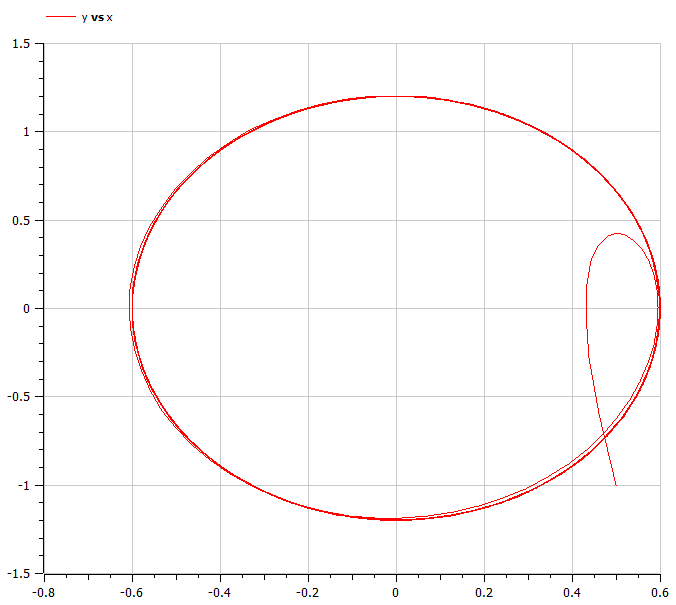

---
## Front matter
lang: ru-RU
title: Модель гармонических колебаний
author: |
	Казаков Александр НПИбд-02-19\inst{1}

institute: |
	\inst{1}Российский Университет Дружбы Народов

date: 23 мая, 2022, Москва, Россия

## Formatting
mainfont: PT Serif
romanfont: PT Serif
sansfont: PT Sans
monofont: PT Mono
toc: false
slide_level: 2
theme: metropolis
header-includes: 
 - \metroset{progressbar=frametitle,sectionpage=progressbar,numbering=fraction}
 - '\makeatletter'
 - '\beamer@ignorenonframefalse'
 - '\makeatother'
aspectratio: 43
section-titles: true

---

# Цели и задачи работы

## Цель лабораторной работы

Изучить модель гармонических колебаний.

## Задание к лабораторной работе

1.	Построить решение уравнения гармонического осциллятора без затухания.
2.	Записать уравнение свободных колебаний гармонического осциллятора с затуханием, построить его решение. Построить фазовый портрет гармонических колебаний с затуханием.
3.	Записать уравнение колебаний гармонического осциллятора, если на систему действует внешняя сила, построить его решение. Построить фазовый портрет колебаний с действием внешней силы.

# Процесс выполнения лабораторной работы

## Задача

Постройте фазовый портрет гармонического осциллятора и решение уравнения гармонического осциллятора для следующих случаев 

1. Колебания гармонического осциллятора без затуханий и без действий внешней
силы $\ddot{x}+19x=0$
2. Колебания гармонического осциллятора c затуханием и без действий внешней
силы $\ddot{x}+9\dot{x}+10x=0$
3. Колебания гармонического осциллятора c затуханием и под действием внешней
силы $\ddot{x}+5\dot{x}+4x=6\cos{2t}$

На интервале $t \in [ 0;61 ]$, шаг 0.05, $x_0=0.5, y_0=-1$

## Первый случай. Колебания гармонического осциллятора без затуханий и без действий внешней силы

$\ddot{x}+19x=0$

{ #fig:001 width=70% height=70% }

## Фазовый портрет для первого случая

$\ddot{x}+19x=0$

{ #fig:002 width=70% height=70% }

## Второй случай. Колебания гармонического осциллятора c затуханием и без действий внешней силы

$\ddot{x}+9\dot{x}+10x=0$

{ #fig:003 width=70% height=70% }

## Второй случай. Колебания гармонического осциллятора c затуханием и без действий внешней силы

$\ddot{x}+9\dot{x}+10x=0$

{ #fig:004 width=70% height=70% }

## Третий случай. Колебания гармонического осциллятора c затуханием и под действием внешней силы

$\ddot{x}+5\dot{x}+4x=6\cos{2t}$

{ #fig:005 width=70% height=70% }

## Третий случай. Колебания гармонического осциллятора c затуханием и под действием внешней силы

$\ddot{x}+5\dot{x}+4x=6\cos{2t}$

{ #fig:006 width=70% height=70% }

# Итоги

## Вывод

Изучена модель гармонических колебаний. Построены графики решения уравнения гармонического осциллятора и фазовые портреты гармонических колебаний без затухания, с затуханием и при действии внешней силы.