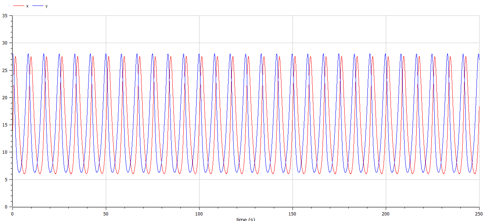
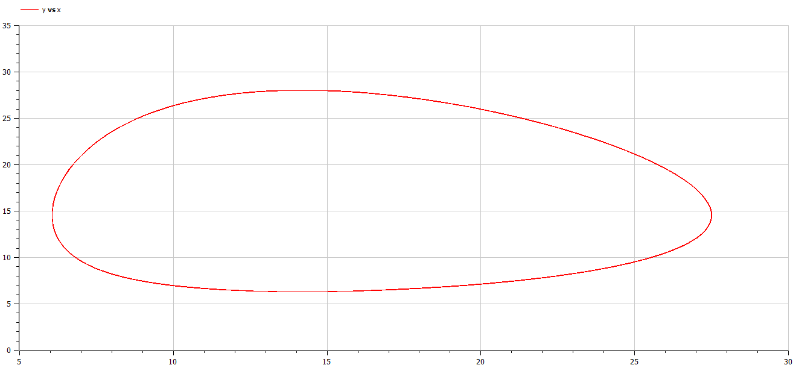

---
# Front matter
lang: ru-RU
title: "Отчет по лабораторной работе №5"
subtitle: "Модель хищник-жертва - вариант 48"
author: "Казаков Александр НПИбд-02-19"

# Formatting
toc-title: "Содержание"
toc: true # Table of contents
toc_depth: 2
lof: true # List of figures
fontsize: 12pt
linestretch: 1.5
papersize: a4paper
documentclass: scrreprt
polyglossia-lang: russian
polyglossia-otherlangs: english
mainfont: PT Serif
romanfont: PT Serif
sansfont: PT Sans
monofont: PT Mono
mainfontoptions: Ligatures=TeX
romanfontoptions: Ligatures=TeX
sansfontoptions: Ligatures=TeX,Scale=MatchLowercase
monofontoptions: Scale=MatchLowercase
indent: true
pdf-engine: lualatex
header-includes:
  - \linepenalty=10 # the penalty added to the badness of each line within a paragraph (no associated penalty node) Increasing the υalue makes tex try to haυe fewer lines in the paragraph.
  - \interlinepenalty=0 # υalue of the penalty (node) added after each line of a paragraph.
  - \hyphenpenalty=50 # the penalty for line breaking at an automatically inserted hyphen
  - \exhyphenpenalty=50 # the penalty for line breaking at an explicit hyphen
  - \binoppenalty=700 # the penalty for breaking a line at a binary operator
  - \relpenalty=500 # the penalty for breaking a line at a relation
  - \clubpenalty=150 # extra penalty for breaking after first line of a paragraph
  - \widowpenalty=150 # extra penalty for breaking before last line of a paragraph
  - \displaywidowpenalty=50 # extra penalty for breaking before last line before a display math
  - \brokenpenalty=100 # extra penalty for page breaking after a hyphenated line
  - \predisplaypenalty=10000 # penalty for breaking before a display
  - \postdisplaypenalty=0 # penalty for breaking after a display
  - \floatingpenalty = 20000 # penalty for splitting an insertion (can only be split footnote in standard LaTeX)
  - \raggedbottom # or \flushbottom
  - \usepackage{float} # keep figures where there are in the text
  - \floatplacement{figure}{H} # keep figures where there are in the text
---

# Цель работы

Изучить простейшую модель взаимодействия двух видов типа «хищник — жертва» - модель Лотки-Вольтерры.

# Задание

1.	Построить график зависимости $x$ от $y$ и графики функций $x(t)$, $y(t)$
2.	Найти стационарное состояние системы


# Выполнение лабораторной работы

## Теоретические сведения

Простейшая модель взаимодействия двух видов типа «хищник — жертва» - модель Лотки-Вольтерры. Данная двувидовая модель основывается на следующих предположениях:
1.	Численность популяции жертв и хищников зависят только от времени (модель не учитывает пространственное распределение популяции на занимаемой территории) 
2.	В отсутствии взаимодействия численность видов изменяется по модели Мальтуса, при этом число жертв увеличивается, а число хищников падает 
3.	Естественная смертность жертвы и естественная рождаемость хищника считаются несущественными 
4.	Эффект насыщения численности обеих популяций не учитывается 
5.	Скорость роста численности жертв уменьшается пропорционально численности хищников:

$$
 \begin{cases}
	\frac{dx}{dt} = (-ax(t) + by(t)x(t))
	\\   
	\frac{dy}{dt} = (cy(t) - dy(t)x(t))
 \end{cases}
$$

В этой модели $x$ – число жертв, $y$ - число хищников. Коэффициент $a$ описывает скорость естественного прироста числа жертв в отсутствие хищников, $с$ - естественное вымирание хищников, лишенных пищи в виде жертв Вероятность взаимодействия жертвы и хищника считается пропорциональной как количеству жертв, так и числу самих хищников $(xy)$. Каждый акт взаимодействия уменьшает популяцию жертв, но способствует увеличению популяции хищников (члены $-bxy$ и $dxy$ в правой части уравнения). 


## Задача

Для модели «хищник-жертва»:

$$
 \begin{cases}
	\frac{dx}{dt} = -0.8x(t) + 0.055y(t)x(t)
	\\   
	\frac{dy}{dt} = 0.78y(t) - 0.055y(t)x(t)
 \end{cases}
$$

Постройте график зависимости численности хищников от численности жертв, а также графики изменения численности хищников и численности жертв 
при следующих начальных условиях: $x_0=14, y_0=28$
Найдите стационарное состояние системы


```
model lab5

parameter Real a = 0.8;
parameter Real b = 0.055;
parameter Real c = 0.78;
parameter Real d = 0.055;

Real x(start = 14);
Real y(start = 28);

equation
der(x) = -a * x + b * x * y;
der(y) = c * y - d * x * y;

annotation(experiment(StartTime = 0, StopTime = 250, Interval = 0.05));
end lab5;

```

{ #fig:001 width=70% height=70% }

{ #fig:002 width=70% height=70% }

Стационарное состояние $x_0=\frac{a}{b}=1.026, y_0=\frac{c}{d}=1$

# Выводы

В ходе выполнения лабораторной работы была изучена простейшая модель взаимодействия двух видов типа «хищник — жертва» - модель Лотки-Вольтерры, построены графики зависимости численности жертв и хищников от времени и зависимости численности хищников от изменения численности жертв.

# Список литературы {.unnumbered}

1. [Документация по системе Modelica – Режим доступа: https://www.modelica.org/](https://www.modelica.org/)
2. [Введение в математическое моделирование : учебное пособие / В.Н. Ашихмин, М.Б. Гитман, И.Э. Келлер [и др.]; Под ред. П.В. Трусова. - Электронные текстовые данные. - М. : Логос, 2015. - 440 с. : ил. - (Новая Университетская Библиотека). - ISBN 978-5-98704-637-1.](http://lib.rudn.ru/ProtectedView/Book/ViewBook/5847)