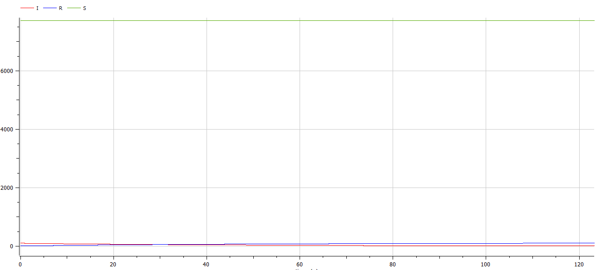
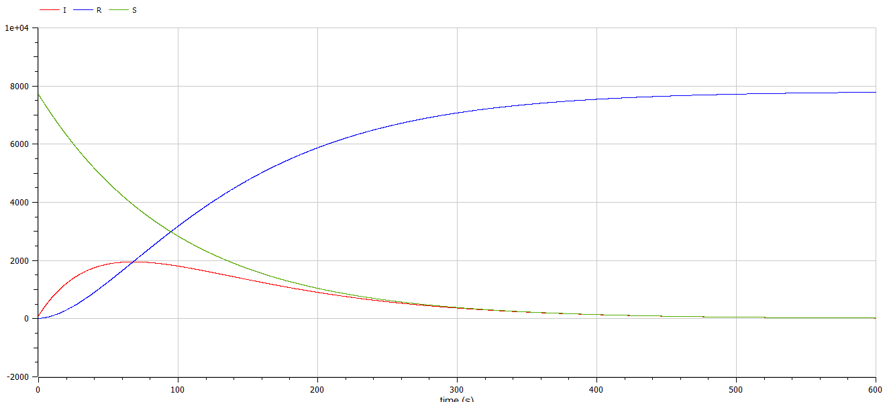

---
## Front matter
lang: ru-RU
title: Простейшая модель эпидемии 
author: |
	Казаков Александр	НПИбд-02-19\inst{1}

institute: |
	\inst{1}Российский Университет Дружбы Народов

date: 23 мая, 2022, Москва, Россия

## Formatting
mainfont: PT Serif
romanfont: PT Serif
sansfont: PT Sans
monofont: PT Mono
toc: false
slide_level: 2
theme: metropolis
header-includes: 
 - \metroset{progressbar=frametitle,sectionpage=progressbar,numbering=fraction}
 - '\makeatletter'
 - '\beamer@ignorenonframefalse'
 - '\makeatother'
aspectratio: 43
section-titles: true

---

# Цели и задачи работы

## Цель лабораторной работы

Изучить простейшую модель эпидемии

## Задание к лабораторной работе

1.	Изучить простейшую модель эпидемии
2.	Построить графики изменения числа особей в каждой из трех групп. Рассмотреть, как будет протекать эпидемия в случае: $I(0)\leq I^*$, $I(0)>I^*$

# Процесс выполнения лабораторной работы

## Задача

На одном острове вспыхнула эпидемия. Известно, что из всех проживающих на острове $(N=7823)$ в момент начала эпидемии $(t=0)$ число заболевших людей (являющихся распространителями инфекции) $I(0)=103$, А число здоровых людей с иммунитетом к болезни $R(0)=10$. Таким образом, число людей восприимчивых к болезни, но пока здоровых, в начальный момент времени $S(0)=N-I(0)-R(0)$.
Постройте графики изменения числа особей в каждой из трех групп.

Рассмотрите, как будет протекать эпидемия в случае:

1.	$I(0)\leq I^*$
2.	$I(0)>I^*$

## Первый случай

$I(0)\leq I^*$

```
parameter Real a = 0.01;
parameter Real b = 0.02;
Real S(start = 7710);
Real I(start = 103);
Real R(start = 10);

equation
der(S) = 0;
der(I) = -b * I;
der(R) = b * I;
annotation(experiment(StartTime = 0, StopTime = 500, Interval = 0.05));

```

## График изменения числа особей в случае $I(0)\leq I^*$

{ #fig:001 width=70% height=70% }

## Второй случай

$I(0)>I^*$

```
parameter Real a = 0.01;
parameter Real b = 0.02;
Real S(start = 7710);
Real I(start = 103);
Real R(start = 10);

equation
der(S) = -a * S;
der(I) = a * S - b * I;
der(R) = b * I;
annotation(experiment(StartTime = 0, StopTime = 500, Interval = 0.05));

```

## График изменения числа особей в случае $I(0)>I^*$

{ #fig:002 width=70% height=70% }

# Итоги

## Вывод

Изучена простейшая модель эпидемии, построены графики изменения числа особей.