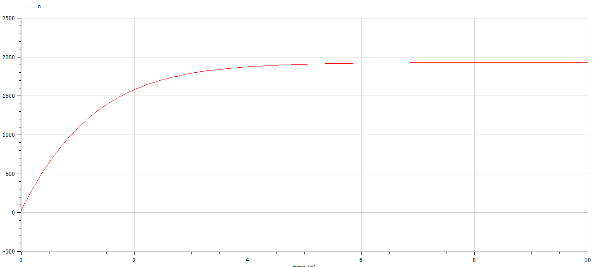
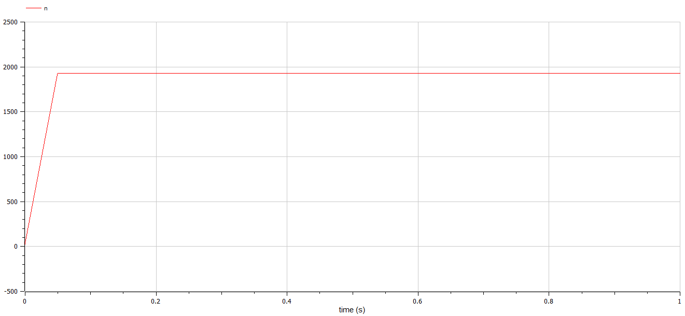

---
## Front matter
lang: ru-RU
title: Модель распространения рекламы
author: |
	Казаков Александр НПИбд-02-19\inst{1}

institute: |
	\inst{1}Российский Университет Дружбы Народов

date: 23 мая, 2022, Москва, Россия

## Formatting
mainfont: PT Serif
romanfont: PT Serif
sansfont: PT Sans
monofont: PT Mono
toc: false
slide_level: 2
theme: metropolis
header-includes: 
 - \metroset{progressbar=frametitle,sectionpage=progressbar,numbering=fraction}
 - '\makeatletter'
 - '\beamer@ignorenonframefalse'
 - '\makeatother'
aspectratio: 43
section-titles: true

---

# Цели и задачи работы

## Цель лабораторной работы

Изучить модель эффективности рекламной кампании

## Задание к лабораторной работе

1.	Изучить модель эффективности рекламной кампании.
2.	Построить графики распространения рекламы по заданным математическим моделям.
3.	Определить для случая 2 момент времени, в который скорость распространения рекламы будет максимальной.

# Процесс выполнения лабораторной работы

## Условие задачи

Постройте график распространения рекламы, математическая модель которой описывается следующим уравнением:

1.	$\frac{dn}{dt} = (0.766 + 0.000082n(t))(N-n(t))$
2.	$\frac{dn}{dt} = (0.0000866 + 0.7n(t))(N-n(t))$
3.	$\frac{dn}{dt} = (0.95\sin(t) + 0.32\cos(9t)n(t))(N-n(t))$

При этом объем аудитории $N$ = 1930, в начальный момент о товаре знает 27 человек.

Для случая 2 определите в какой момент времени скорость распространения рекламы будет иметь максимальное значение.

## Первый случай

$\frac{dn}{dt} = (0.766 + 0.000082n(t))(N-n(t))$

```
model lab7_1

parameter Real a = 0.766;
parameter Real b = 0.000082;
parameter Real N = 1930;

Real n(start = 27);

equation
der(n) = (a + b * n) * (N - n);

annotation(experiment(StartTime = 0, StopTime = 10, Interval = 0.05));
end lab7_1;

```

## График для первого случая

{ #fig:003 width=70% height=70% }

## Второй случай

$\frac{dn}{dt} = (0.0000866 + 0.7n(t))(N-n(t))$

```
model lab7_2

parameter Real a = 0.0000866;
parameter Real b = 0.7;
parameter Real N = 1930;

Real n(start = 27);

equation
der(n) = (a + b * n) * (N - n);

annotation(experiment(StartTime = 0, StopTime = 0.1, Interval = 0.05));
end lab7_2;

```

## График для второго случая

{ #fig:004 width=70% height=70% }

максимальная скорость распространения при $t=0$

## Третий случай

$\frac{dn}{dt} = (0.95\sin(t) + 0.32\cos(9t)n(t))(N-n(t))$

```
model lab7_3

parameter Real a = 0.95;
parameter Real b = 0.95;
parameter Real N = 1930;

Real n(start = 27);

equation
der(n) = (a * sin (1 * time) + b * cos (9 * time) * n) * (N - n); 

annotation(experiment(StartTime = 0, StopTime = 0.1, Interval = 0.05));
end lab7_3;

```

## График для третьего случая

{ #fig:005 width=70% height=70% }

# Итоги

## Вывод

Изучена модель эффективности рекламы, построены графики распространения рекламы.