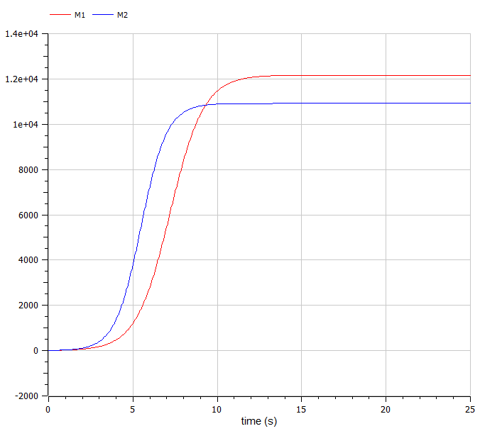
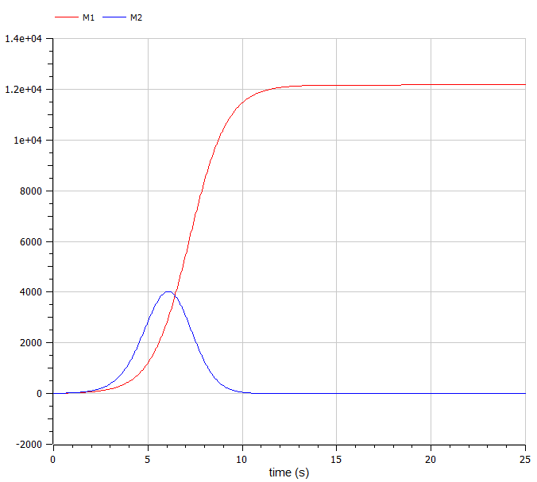

---
## Front matter
lang: ru-RU
title: Модель конкуренции двух фирм
author: |
	Казаков Александр НПИбд-02-19\inst{1}

institute: |
	\inst{1}Российский Университет Дружбы Народов

date: 23 мая, 2022, Москва, Россия

## Formatting
mainfont: PT Serif
romanfont: PT Serif
sansfont: PT Sans
monofont: PT Mono
toc: false
slide_level: 2
theme: metropolis
header-includes: 
 - \metroset{progressbar=frametitle,sectionpage=progressbar,numbering=fraction}
 - '\makeatletter'
 - '\beamer@ignorenonframefalse'
 - '\makeatother'
aspectratio: 43
section-titles: true

---

# Цели и задачи работы

## Цель лабораторной работы

Изучить модель конкуренции двух фирм

## Задание к лабораторной работе

1.	Изучить модель конкуренции двух фирм
2.	Построить графики изменения оборотных средств в двух случаях

# Процесс выполнения лабораторной работы

## Случай 1

Рассмотрим две фирмы, производящие взаимозаменяемые товары одинакового качества и находящиеся в одной рыночной нише. Считаем, что в рамках нашей модели конкурентная борьба ведётся только рыночными методами, а постоянные издержки пренебрежимо малы.

$$ \frac{dM_1}{d\Theta} = M_1 - \frac{b}{c_1}M_1 M_2 - \frac{a1}{c1} M_1^2 $$

$$ \frac{dM_2}{d\Theta} = \frac{c_2}{c_1} M_2 - \frac{b}{c_1} M_1 M_2 - \frac{a_2}{c_1} M_2^2 $$

## Случай 2

Рассмотрим модель, когда, помимо экономического фактора влияния используются еще и социально-психологические факторы.

$$\frac{dM_1}{d\Theta} = M_1 - \frac{b}{c_1}M_1 M_2 - \frac{a1}{c1} M_1^2 $$

$$ \frac{dM_2}{d\Theta} = \frac{c_2}{c_1} M_2 - (\frac{b}{c_1} + 0.00028) M_1 M_2 - \frac{a_2}{c_1} M_2^2$$

## Начальные условия и параметры

$$ M_0^1=8.95 \: M_0^2=8.12 $$
$$ p_{cr}=31 \: N=72 \: q=1 $$
$$ \tau_1=30 \: \tau_2=34 $$
$$ \widetilde{p}_1=7.4 \: \widetilde{p}_2=5.4 $$

## График для первого случая

{ #fig:001 width=70% height=70% }

## График для второго случая

{ #fig:002 width=70% height=70% }

# Итоги

## Вывод

Изучена модель конкуренции двух фирм, построены соответствующие графики изменения оборотных средств в двух случаях.